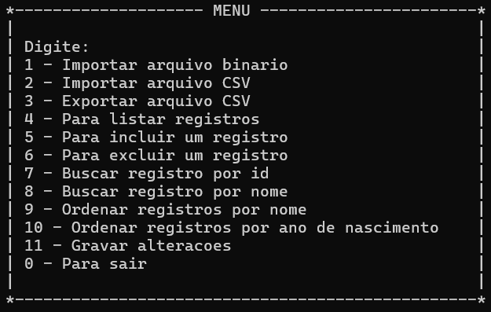
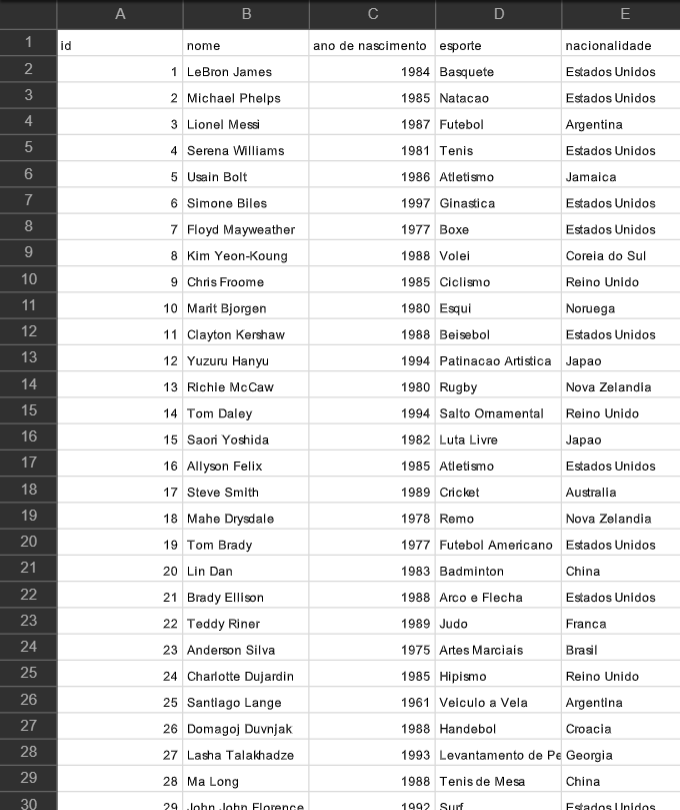

# Sistema de Cadastro em Arquivos com Ordenação
O objetivo deste trabalho é implementar um sistema de cadastro (com recursos para busca e alteração de dados) com armazenamento dos dados em arquivos binários.

A aplicação conta com o seguinte menu interativo:

A aplicação desenvolvida deverá possuir uma série de características, listadas a seguir. Para fins de exemplificação, suponha que os dados a serem armazenados possuem, entre seus campos, as seguintes informações: nome, idade e endereço:
- Os dados devem ser armazenados em um arquivo tipado, mas com capacidade de importação e exportação dos dados para o formato CSV, ou seja, deve ser possível ler os dados a partir de um arquivo .csv e também gravar os dados em um arquivo .csv.
- A aplicação deverá inicialmente carregar os dados do arquivo tipado em um vetor alocado dinamicamente. O tamanho inicial do vetor deverá ser capaz de suportar 40 elementos, sendo redimensionado de acordo com a necessidade. A operação de redimensionamento deve adicionar 5 ou 10 posições a cada operação.
- Deve ser possível inserir um novo elemento. Nesse caso, a inserção será realizada no final do vetor. Opcionalmente, vocês também podem optar por fazer uma inserção ordenada, para facilitar o uso de busca binária (ou seja, o elemento é inserido de forma a manter os dados ordenados).
- A aplicação deverá ser capaz de remover dados existentes. A remoção pode ser feita de forma lógica, ou seja: o objeto não é apagado diretamente, mas apenas marcado (com uma chave negativa, por exemplo). O elemento também deve ser removido totalmente quando o arquivo for gravado novamente.
- Antes do término da aplicação, deve haver uma opção para permitir gravar as novas alterações (remoções e inserções realizadas). Essa opção poderá fazer parte do menu principal da aplicação ou pode ser oferecida logo após a inserção ou remoção dos dados, a critério da equipe.
- Deve ser possível buscar um registro, utilizando-se um dos campos. Nesse caso, deve ser possível fazer a busca por pelo menos duas formas diferentes  (no nosso exemplo: por nome ou por idade ou por endereço). Para cada um desses campos, deve ser implementada a busca binária (recursiva ou iterativa). Note, que para fazer busca binária, os dados deverão estar ordenados.
- Deve ser possível mostrar na tela tanto o arquivo inteiro, como um trecho informado pelo usuário. Por exemplo, deve ser possível mostrar do décimo ao vigésimo elemento do arquivo. A impressão deve ser realizada na ordem em que estão armazenados. 
- Deve ser possível ordenar os dados por pelo menos dois dos campos  do registro. No exemplo dado, a aplicação poderia dar a opção de ordenar por nome ou idade. A ordenação deverá ser feita em memória (todos os dados do arquivo são lidos em um vetor na memória e então ordenados). Como já comentado anteriormente, antes do término da aplicação (ou logo após a ordenação), deve haver a opção de gravar as alterações no arquivo.

### Exemplo de registros utilizados (registros-atletas.csv):
 